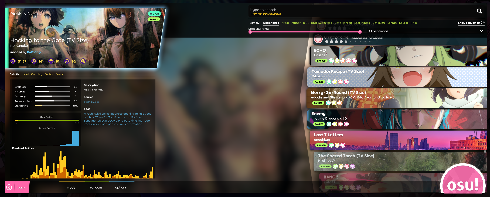

# OSU! Lazer map selection

For the context, one of my friends tell me for a project that it would be cool to have the same kind of selection than what OSU! has for his maps. So I create the thing based on a screenshot I took (see below).

## Issues

1. I wasn't able to get the thing where the select items poped out. It's possible, I know that, but it's too much to get that to work fluidly.
1. I didn't do everything, that's because I only did thing that we could use for the main project, even if this work (the OSU! selection map) was a joke of me.
